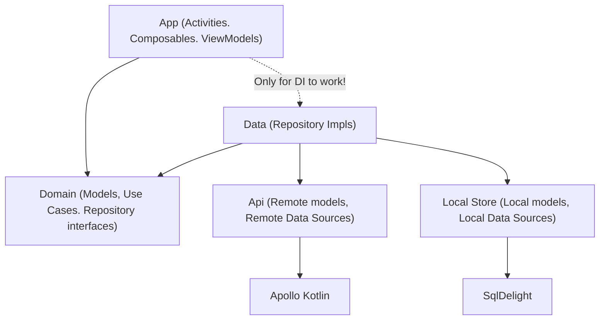

# WIP!!!!!!!!

## Modules / Architecture

```mermaid
graph TD
    App["App (Activities. Composables. ViewModels)"] --> Domain
    App -.->|Only for DI to work!| Data
    Domain["Domain (Models, Use Cases. Repository interfaces)"]
    Data["Data (Repository Impls)"] --> Domain
    Data --> Api
    Data --> LocalStore
    Api["Api (Remote models, Remote Data Sources)"]
    Api --> Apollo[Apollo Kotlin]
    LocalStore["Local Store (Local models, Local Data Sources)"]
    LocalStore --> SqlDelight
```
