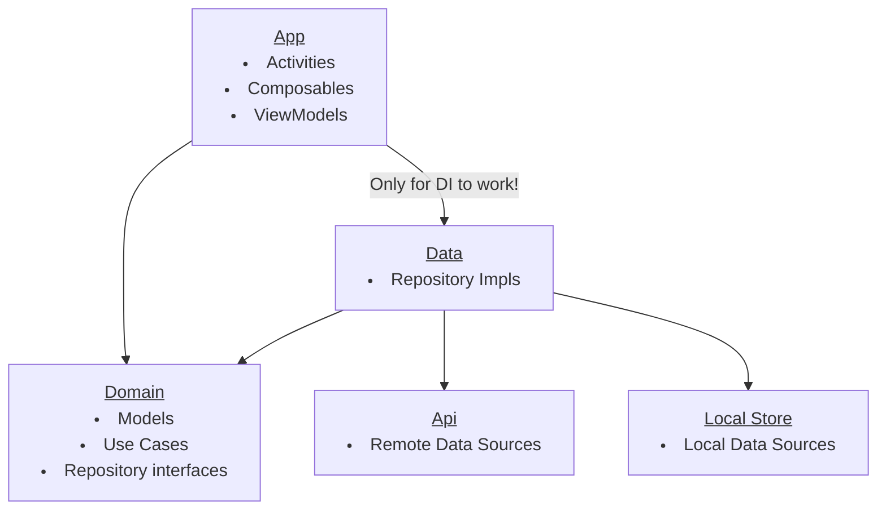

# WIP!!!!!!!!

## Modules / Architecture

```mermaid
graph TD
    App[<u>App</u> <li>Activities <li>Composables <li>ViewModels] --> Domain
    App -->|Only for DI to work!| Data
    Domain[<u>Domain</u> <li>Models <li>Use Cases <li>Repository interfaces]
    Data[<u>Data</u> <li>Repository Impls] --> Domain
    Data --> Api
    Data --> LocalStore
    Api[<u>Api</u> <li>Remote Data Sources]
    LocalStore[<u>Local Store</u> <li>Local Data Sources]
```
